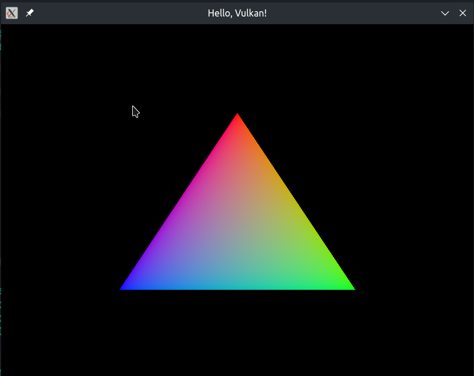

# Building

**Note:** make sure you have `glslc` on your `$PATH` as CMake will use it to compile the shaders.

1. `git clone --recursive https://github.com/Ligh7bringer/HelloVulkan.git`
2. Use `CMake` to generate a VS solution/Makefiles/etc., e.g.:
    1. `mkdir build && cd build`
    2. `cmake -GNinja ..`
3. Compile the executable:
    1. `cmake --build .`

---

